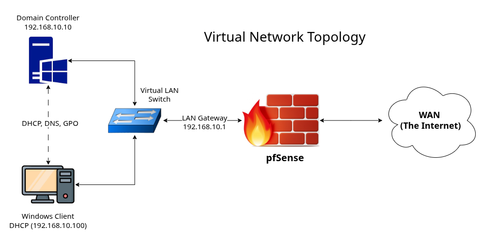
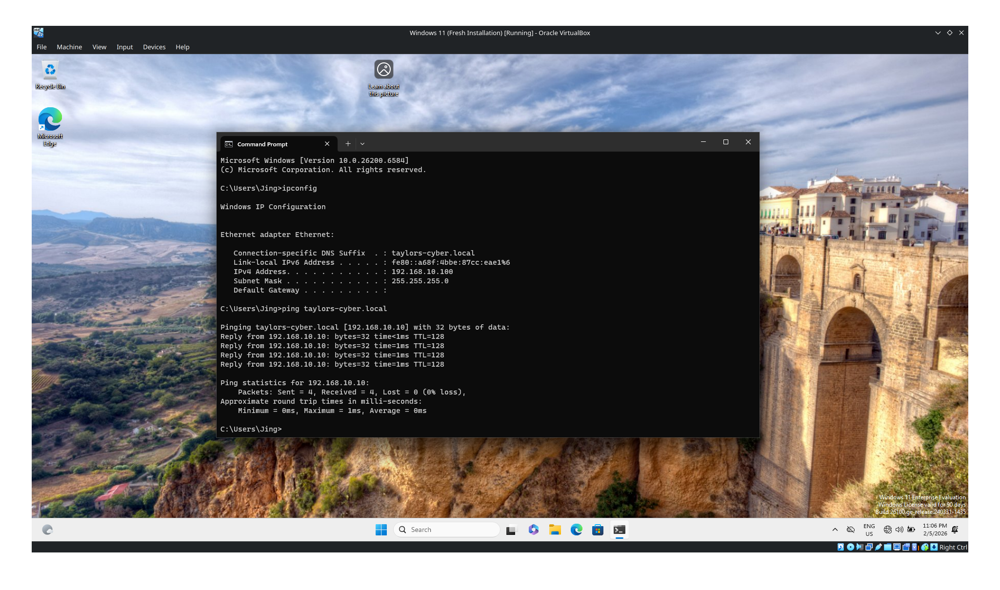
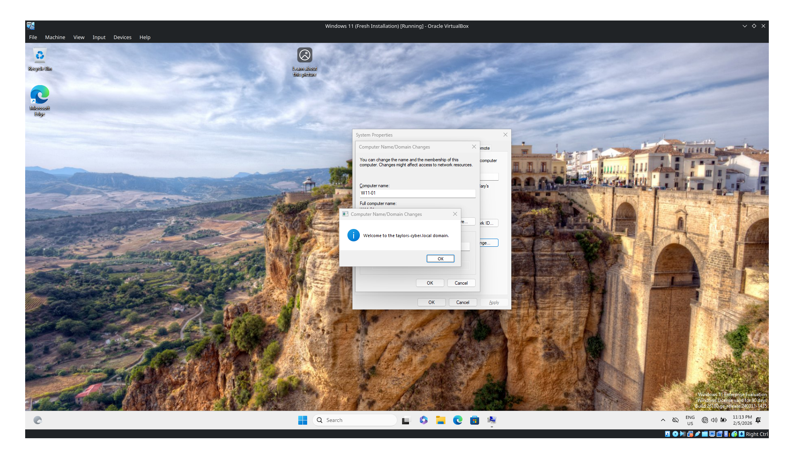
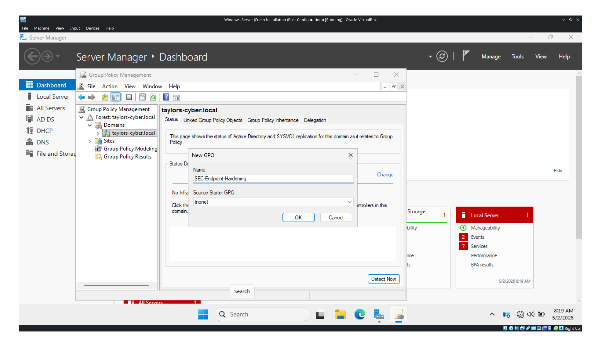
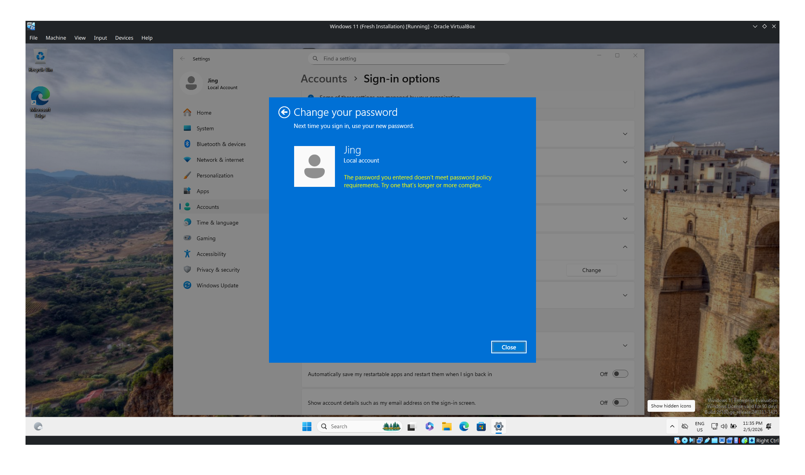

# Active Directory Hardening Lab

## Objective
The primary goal of this project is to engineer a centralized identity management environment and enforce security baseline configurations via Group Policy.

## Architecture
- **Network Subnet:** `192.168.10.0/24`
- **Gateway (pfSense Firewall):** `192.168.10.1`
- **Domain Name:** `taylors-cyber.local`

**Virtual Machines:**
1. **Domain Controller (Windows Server 2022)**
   - **Hostname:** `DC-01`
   - **Static IP:** `192.168.10.10`
   - **Roles Installed:** Active Directory Domain Services (AD DS), DNS, DHCP
2. **Endpoint Client (Windows 11 Enterprise)**
   - **Hostname:** `W11-01`
   - **IP Address:** `192.168.10.100` (Assigned dynamically via DC-01 DHCP Scope)

## Security Controls Applied
A Group Policy Object (GPO) named `SEC-Endpoint-Hardening` was created and linked to the domain to enforce the following enterprise security baselines:

1. **12-Character Password Complexity**
   - *Configuration:* Enforced a minimum password length of 12 characters and enabled strict complexity requirements. This protects user identities by mitigating brute-force, dictionary, and password-spraying attacks.
2. **Removable Media Restrictions (USB Deny All)**
   - *Configuration:* Denied read/write/execute access to all removable storage classes.This prevents physical data exfiltration by insider threats and mitigates the risk of malware introduction via malicious USB drops.

---

## Lab Evidence & Screenshots

### 1. Endpoint DHCP Lease & Network Connectivity
*Windows 11 client successfully pulling the `192.168.10.100` IP from the Windows Server DHCP scope and pinging the domain.*

### 2. Successful Domain Join
*Windows 11 client successfully joined to the `taylors-cyber.local` domain.*

### 3. Security Group Policy (GPO) Deployment
*Creation and linking of the `SEC-Endpoint-Hardening` policy within the Group Policy Management tool.*

### 4. GPO Enforcement Verification
*Testing the policy on the endpoint: Windows 11 rejecting a password change attempt because it does not meet the newly enforced 12-character complexity requirement.*

